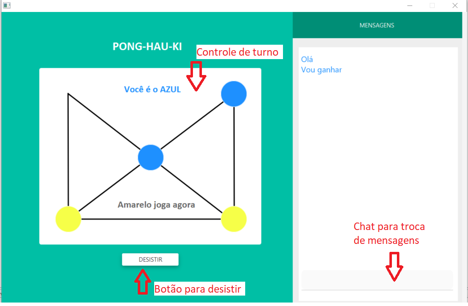
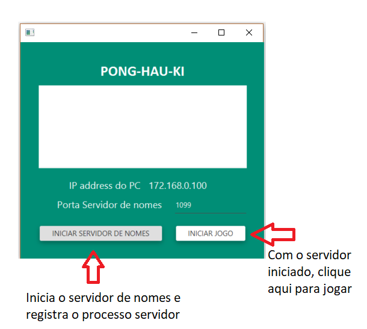

# PongHauKi Parallel and Distributed
A game using Parallel and Distributed concepts

### Objetivo: Implementar o Jogo da Tabuleiro PONG-HAU-KI

Esse jogo tem origem na China e se estendeu para alguns países da Ásia como Coréia. O objetivo
do jogo é movimentar as peças pelas linhas até que se consiga bloquear o movimento das peças do
adversário.

### Funcionalidades Básicas

- Controle de turno, com definição de quem inicia a partida
- Movimentação de Peças
- Detecção de desistência
- Chat para comunicação durante toda a partida
- Reiniciar partida

## Composição do projeto
- Parte 1 - usando comunicação via sockets
- Parte 2 - usando RMI

### Parte 2 - Instruções 

Antes de começa o jogor é necessário definir a porta do servidor de nomes e, em seguida, iniciá-lo:  
